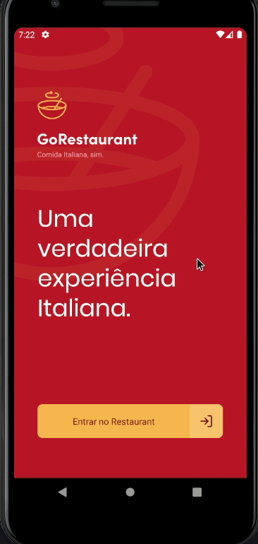

# desafio_11_GoRestaurant_Mobile

Decimo primeiro desafio GoStack12 - React-native and typescript

realizado com base no repositório: [repositório](https://github.com/rocketseat-education/gostack-template-react-native-delivery)

Este desafio foi realizado com react-native and typescript.

## Para rodar no android:
- Clone o repositório para a sua maquina
- Istale as dependencias: ``yarn``
- Inicie o fake server: ``yarn json-server server.json -p 3333``
- Inicie o metro bundler: ``yarn start``
- Verifique a url local do seu emulador:
  - Caso seja Iphone o ip padrão é: ``http://localhost:3333``
  - Caso seja um emulador Android é nessesario rodar: ``adb reverse tcp:3333 tcp:3333`` e a url será a mesma (``http://localhost:3333``)
  - Caso nessesario alterar a url é no arquivo src/services/api.ts

## Print:

